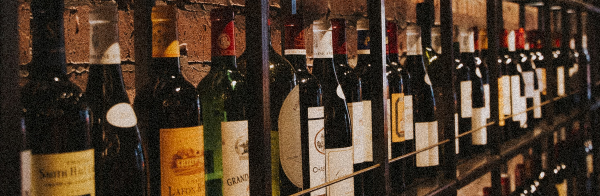

# Wine Quality Prediction Model

This repository contains a simple wine quality price prediction model built using Linear Regression. The model predicts the quality of wine based on various features such as fixed acidity, volatile acidity, citric acid, residual sugar and more.

## Dataset

The dataset used for training and testing the model can be found in the `./dataset` directory. It includes information about wine's characteristics and quality.

## Model Evaluation

The model's performance is evaluated using Mean Squared Error (MSE) and R-squared (R2) score. The evaluation results are displayed in the Jupyter Notebook.
The model is saved in the `./model` directory using joblib.